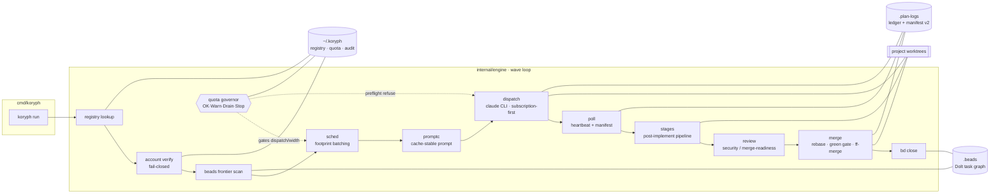
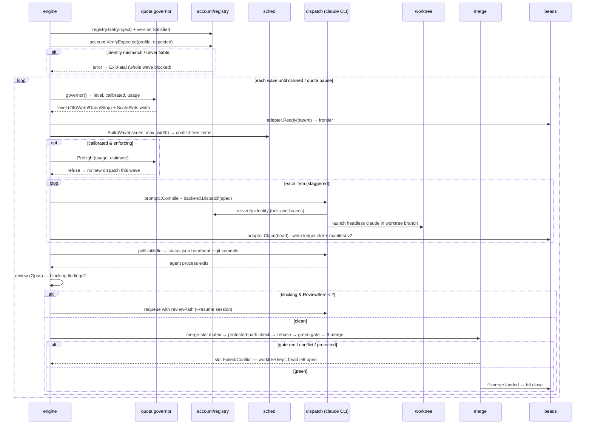

<!-- SPDX-License-Identifier: Apache-2.0 -->
<!-- Copyright (c) 2026 The Koryph Developers -->

# Architecture

koryph is a multi-project orchestrator that drives autonomous Claude Code
agents through a repeating **wave loop**: it reads ready work from beads,
schedules a conflict-free batch, dispatches each bead to a headless `claude`
CLI running in an isolated git worktree, polls the agents to completion,
reviews and merges the green ones, and closes the bead. Every stage is a
distinct Go package so it can be swapped, mocked, or re-entered on recovery
without dragging the rest of the pipeline along.

See the [enhancement roadmap](https://github.com/koryph/koryph/blob/main/docs/designs/2026-07-enhancement-roadmap.md)
(kept in-repo, not in the published book) for design rationale and migration
history.

## Component map

Data flows left-to-right through the wave; the quota governor, ledger, and
registry audit are cross-cutting and touch every dispatch.

## Module map

| Path | Role |
|---|---|
| `cmd/koryph` | CLI entry point (`run`, `project`, `quota`, `batch`, `ops`, `init`) |
| `internal/engine` | wave loop (scan → batch → preflight → dispatch → poll → stages → review → merge → record) |
| `internal/registry` | multi-project registry + audit log (`~/.koryph`, git-backed) |
| `internal/account` | Claude env construction + fail-closed identity verification |
| `internal/dispatch` | dispatch backend (headless `claude` CLI, subscription-first) |
| `internal/anthro` | direct Anthropic API + Message Batches (explicit only) |
| `internal/beads` | bd adapter (ready graph, labels, merge slot, children) |
| `internal/sched` | footprint conflict coloring + wave building |
| `internal/ledger` | run ledger + checkpoint manifest v2 + resume classification |
| `internal/worktree` | worktree lifecycle (ensure/bootstrap/remove) |
| `internal/merge` | rebase → green gate → ff-merge + protected paths |
| `internal/quota` | per-account usage windows + Warn/Drain/Stop governor (cost) |
| `internal/govern` | machine-global concurrency cap across projects (rate-limit safety) |
| `internal/modelroute` | stage/label model resolution + rationale |
| `internal/promptc` | cache-stable prompt compiler |
| `internal/review` | optional security-reviewer / merge-readiness pass |
| `internal/stage` | post-implement pipeline stages (docs/test/…) run in-worktree before merge |
| `internal/version` | `engine_version` pinning (semver-minimum satisfaction) |
| `internal/project` | per-project adapter config (`koryph.project.json`) |
| `internal/onboard` | project onboarding/migration (dry-run first) |
| `internal/scaffold` | hash-aware installer for embedded `.claude` assets (force-guarded) |
| `internal/commands` | embedded `koryph-*` Claude slash commands + installer |
| `internal/rules` | hook scripts + additive `.claude/settings.json` merge (enforcement wiring) |
| `hooks/` | shipped Claude Code hooks (agent-boundary guard, worktree guard) |
| `agents/` | global fallback personas for projects with no local `.claude/agents/*` |

## One wave, end-to-end

## State ownership

koryph is deliberate about *where* each kind of state lives and how durable
it is. Three stores plus the worktrees, with no overlap:

| Layer | Owns | Lifetime / sync |
|---|---|---|
| `~/.koryph/` | Project registry (`registry.d/<id>.json`), account map, per-account quota calibration, cross-project run index, `audit.jsonl` | Itself a git repo — every mutation is an atomic write + audit append + commit, reversible |
| `<project>/.plan-logs/` | Run ledgers, checkpoint manifests (`koryph/<run>/<bead>/manifest.json`), per-dispatch `status.json` / `SUMMARY.md` / `session.log` | Repo-local; records *where things stand*, but the durable checkpoint is the worktree commit, not the manifest |
| `<project>/.beads/` | Task/plan state, dependency graph, `koryph-plan` blocks, merge/model/risk labels | Project-local Dolt DB; syncs cross-machine via its own Dolt remote — never through worktree git merges |
| `<project>` worktrees | In-flight agent work (committed + uncommitted) | Ephemeral; only as durable as its last commit; never removed while dirty without approval |

Rule of thumb: **cross-project** state lives in `~/.koryph/`;
**per-project durable** state lives in beads and `.plan-logs/`; **in-flight**
state lives in the worktree and is only as durable as its last commit.

## The wave loop

`engine.Run` sets up once (registry lookup, version check, identity
verification, run lock) and then calls `loop`, which repeats until the frontier
drains, the governor pauses on quota, the context is cancelled, or `--once`
settles exactly one wave. Each iteration:

1. **Govern.** `governor()` loads quota config and snapshots usage, returning a
   `Level` and whether the account is `calibrated`. The billing-guard mode is
   resolved, and `ScaleSlots` may shrink the wave width below the configured
   maximum as usage climbs.
2. **Scan the frontier.** `beads.Ready` returns issues with no open blockers,
   optionally scoped to a `--parent` epic.
3. **Build the wave.** `sched.BuildWave` filters to eligible, dispatchable
   issues and greedily packs a conflict-free batch up to the width (see
   *footprint batching*).
4. **Preflight.** In loop mode on a calibrated, enforcing governor,
   `quota.Preflight` can refuse the whole wave if its estimated spend would
   breach the drain fraction.
5. **Dispatch.** For each item (optionally staggered by
   `dispatch_stagger_seconds`), `dispatchBead` routes a model, ensures a
   worktree + bootstrap, compiles a prompt, launches the backend, claims the
   bead, and writes a ledger slot + manifest.
6. **Poll.** `pollUntilIdle` ticks every `poll_sec` (default 45), reading each
   slot's `status.json` heartbeat and counting git commits ahead of the base
   branch until every slot reaches a terminal state.
7. **Stages, review, merge, record.** A completed slot first runs any configured
   post-implement `pipeline` stages (docs/test/…) in its worktree; then clean
   slots are reviewed and merged. Requeues refresh the worktree onto current main
   first, so a retry never runs a stale checkout. The ledger and manifest are
   updated so a later `--resume` can re-classify anything left running.

**Footprint batching.** A bead's *footprint* is a set of conflict tokens
derived from `fp:*` labels (explicit), then `area:*` labels mapped through the
project's `AreaMap`, falling back to `TokenUnknown` (so unlabeled work
serializes rather than colliding silently). `BuildWave` greedily colors the
frontier: two beads whose footprints share any token never land in the same
wave, so parallel agents don't fight over the same files. Epics, features,
decisions, merge-requests, `no-dispatch` / `refactor-core` / `gt:*`-gated
issues, already-active beads, and containers with open children are deferred
with a recorded reason.

## Account safety model

Account selection is the first gate, not an afterthought. Before any state is
touched — no lock, no run dir, no worktrees — `account.VerifyExpected` reads
the profile's `.claude.json`, extracts `oauthAccount.emailAddress`, and
compares it case-insensitively against the registry's `ExpectedIdentity`. A
missing file, unparseable JSON, empty email, or mismatch **fails closed**: the
run exits fatal rather than dispatching under a guessed account.

The environment is built explicitly by `account.Env`, never inherited from
ambient shell state. It scrubs `CLAUDE_CONFIG_DIR` and `ANTHROPIC_API_KEY` from
the parent env, then injects `CLAUDE_CONFIG_DIR` only for a work/custom profile
(a personal profile leaves it unset and never points at `~/.claude`), and
injects `ANTHROPIC_API_KEY` only when billing is `BillingAPIKey`. The dispatch
backend re-verifies identity per dispatch as belt-and-braces, recording the
`VerifiedIdentity` on the ledger slot. Headless agents run
`--permission-mode dontAsk`, and the shipped `hooks/` (agent-boundary + worktree
guards) deterministically block an agent from `git checkout main`, `git merge`,
`git push`, `bd close`, or touching another worktree.

## Billing & quota governance

Every account carries two rolling usage windows: a 5-hour window (`Window5h`,
aligned to a fixed UTC grid) and a 7-day `Weekly` window. Each has a
`CeilingUSD` calibrated from the user's observed `/usage` percentage.
`Fraction()` is spent ÷ ceiling; an unmeasurable window reports `1.0` so the
governor **fails closed** rather than over-spending blind. Usage is measured by
`quota.Snapshot`, which prefers the `ccusage` CLI and falls back to scanning
local transcript `*.jsonl` files, and finally to `Source="unavailable"`.

The governor maps the higher of the two window fractions to a level:

| Level | Fraction | Effect |
|---|---|---|
| `LevelOK` | `< 0.80` | Full-width dispatch |
| `LevelWarn` | `≥ WarnFraction` (0.80) | Log a warning; `ScaleSlots` starts shrinking width |
| `LevelDrain` | `≥ DrainFraction` (0.90) | No new dispatch; finish active slots |
| `LevelStop` | `≥ StopFraction` (0.95) | Pause the run (or, with explicit opt-in, switch to API-key billing) |

An account whose ceilings are both zero is *uncalibrated*: the governor
short-circuits to advisory `LevelOK` without probing usage.

**Billing-guard modes.** `guardMode` decides whether these throttling
constraints are *enforced* or merely *advisory*, with precedence: run flag
(`--no-billing-guard`) > project registry (`billing_guard=advisory`) > baseline
(an uncalibrated governor is advisory). In advisory mode the governor measures
and logs but never blocks dispatch and never switches billing. Enforce is the
default.

**Subscription-first.** Dispatch runs on the account's subscription by default
(`BillingSubscription`). Per-token API spend engages *only* at `LevelStop`,
*only* with `--allow-api-spend`, a registry `api_fallback=explicit`, and a
resolvable `APIKeyEnvVar` — logged loudly as the sole path to metered spend.
Message Batches (`internal/anthro`) is a separate, manual entry point: it
requires a purpose-named `KORYPH_BATCH_API_KEY` (it refuses ambient
`ANTHROPIC_API_KEY`) plus per-invocation confirmation, and is never invoked by
the loop, scheduler, or recovery.

## Model routing

`modelroute.Resolve` picks a tier per dispatch. The tiers are `TierHaiku`,
`TierSonnet`, `TierOpus`, and `TierFable`. Stage defaults: planning/design/
scoring/review → **Opus**; implement/docs/test → **Sonnet**; explore/debug →
**Haiku**. Precedence, highest first:

1. explicit `--model` flag
2. stage-scoped label `model:<stage>:<tier>`
3. plain label `model:<tier>`
4. run default (`--default-model`)
5. stage default

**Opus is the ceiling.** Recovery escalation (`RecoveryUpgrade`) always returns
`TierOpus` — low-confidence retries upgrade toward Opus and never toward Fable;
that path is structurally excluded. **Fable is explicit-only.** It resolves
only when the tier is Fable *and* the source was an explicit label/flag *and*
`TierFable` is in the project's `AllowedModels` (the default allowlist —
haiku/sonnet/opus — deliberately omits it). Persona frontmatter can contribute
an `effort` hint, but the resolved tier always wins over any persona `model`.
Every resolution carries a human-readable `Rationale` (e.g. `label
model:plan:opus`, `stage default (implement)`), recorded on the slot and
manifest.

## Recovery & native session resume

Each dispatch writes a **checkpoint manifest v2** (`manifest.json`) alongside
the ledger slot, capturing the session id, worktree, branch, base commit,
attempt, recovery tier, and merge policy. On `--resume`, `ledger.Classify`
inspects each non-terminal slot and probes the world to choose an action:

| Action | Condition | Behavior |
|---|---|---|
| `ActionSkip` | slot already terminal | leave recorded |
| `ActionReattach` | PID alive | keep polling |
| `ActionRequeueResume` | dead, commits present | re-dispatch resuming the session |
| `ActionRequeueFresh` | dead, no commits | fresh dispatch |
| `ActionBlocked` | attempts ≥ max | stop retrying |

**Checkpoint-with-the-work.** Git commits inside the worktree are the primary,
durable checkpoint; the manifest records *where things stand*, but recovery
trusts committed repo state over manifest claims when they disagree. When a
slot with prior commits is requeued, the manifest's `SessionID` drives a
**native resume** — the backend launches `claude --resume <id> --fork-session`
so the agent continues its own session rather than starting cold. A slot with
no commits is re-dispatched fresh. The recovery *tier* (`rt:0`..`rt:3`, label
overrides `risk_tier_default`) is recorded on the manifest to govern how
aggressively work is retried. Stuck detection (`stuck_sec`, default 900)
compares heartbeat/commit mtime and flags a slot informationally without
killing the poll.

## Review, merge policies & protected paths

After an agent exits cleanly, an optional **review** pass runs the
`security-reviewer` persona (on Opus) diffing the branch against its base and
returning strict JSON `{blocking, findings}`. Review is best-effort: any
failure returns a degraded, non-blocking verdict so it can never wedge the
engine. Blocking findings **requeue** the slot with the review path attached
(the agent resumes to address them), up to 2 iterations; after that the policy
is forced to `manual` so nothing auto-merges unreviewed.

`merge.Merge` lands a green branch under a **bd merge-slot mutex** (one merge at
a time). The sequence: a **protected-path check** (`git diff --name-only
base...branch`) rejects the merge outright if it touches any protected path;
then `git fetch` + `git rebase` onto `origin/<default>` (or local default with
no remote); then the **green gate** runs each `cfg.Gate` command sequentially
via `sh -c` (wrapped in `direnv exec` when available) — any non-zero exit aborts
the merge and discards the dirtied tree; then `git merge --ff-only` (or
`--squash`); optional push; and worktree + branch cleanup (skipped if the tree
stays dirty). Results are `merged`, `conflict`, `gate-failed`, `protected`, or
`error`.

`DefaultProtected` covers `CLAUDE.md`, `MEMORY.md`, `CLAUDE-ACCOUNTS.md`,
`koryph.project.json`, `.claude/`, `.beads/`, `scripts/lib/`,
`.pre-commit-config.yaml`, `.gitignore`, `.github/CODEOWNERS`, and `.envrc`;
projects add `Extra` paths. A trailing `/` matches a subtree recursively.
Merge **policy** (`merge:auto` / `merge:manual` / `merge:pr` label on the epic,
else project config) decides whether a green branch merges automatically, waits
for a human, or opens a PR.

## Versioning

The engine pins itself to each project. `project.Config.EngineVersion`
expresses a minimum, e.g. `0.2+` or `>=0.2.3`. `version.Satisfied` normalizes
both sides (strips leading `v`, trailing `+`, `>=`) and compares major.minor.
patch componentwise; an empty requirement is always satisfied. If the running
`koryph` doesn't satisfy the project's `engine_version`, `Run` exits fatal with
an upgrade instruction — a project can require newer engine semantics without
risking an older binary silently mis-driving it. The pinned `EngineVersion`
also flows into `promptc.Compile`, whose cache-stable preamble depends only on
that version — so the prompt cache stays warm across every dispatch of one
engine version, and rotates deliberately when the engine bumps.
