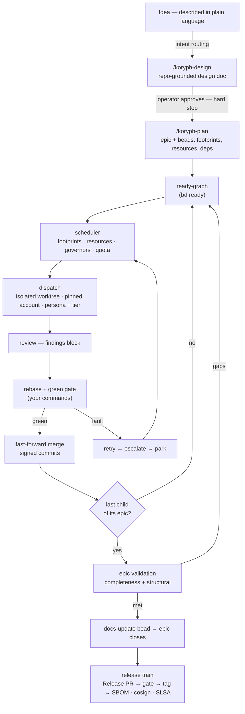

<!-- SPDX-License-Identifier: Apache-2.0 -->
<!-- Copyright (c) 2026 The Koryph Developers -->

# The lifecycle: from prompt to release

koryph runs a complete software development lifecycle — requirements,
design, decomposition, implementation, review, testing, integration,
validation, documentation, release — with agents doing the building and the
engine enforcing the order. This page shows the whole loop once, so every
other chapter has a place to hang from.

## The loop

Three things about this loop are worth noticing before the stage-by-stage
tour:

- **There are exactly two mandatory human moments.** Approving the design
  (the `/koryph-design` stop) and whatever your merge policy reserves for
  you (nothing under `auto`, a PR review under `pr`). Everything else can
  run unattended — and everything that runs unattended is governed,
  gated, and recoverable.
- **Failure re-enters the loop; it never falls out of it.** A red gate, a
  review bounce, or a dead agent becomes a classified retry, an escalation
  to a stronger model, or a parked bead waiting for you — with the reason
  recorded. See [Recovery & escalation](../user-guide/recovery.md).
- **Quality gates run at three altitudes.** Per-branch (review + your green
  gate), per-epic (validation of the union against the design), and
  per-release (gate-before-tag plus a complete, signed, attested asset set).

## Stage by stage

| SDLC phase | What happens in koryph | Where to read more |
|---|---|---|
| Requirements | You describe the ask in a normal agent session; intent routing steers it to the right planning command instead of ad-hoc implementation | [From prompt to beads](../user-guide/describing-work.md) |
| Design | `/koryph-design` clarifies, grounds the design in your actual code, writes a design doc, and **stops for your approval** | [From prompt to beads](../user-guide/describing-work.md#koryph-design) |
| Decomposition | `/koryph-plan` turns the approved doc into an epic plus dependency-linked child beads, each labelled with the footprints, resources, and model routing the scheduler needs | [Work: beads and the ready-graph](beads.md) |
| Scheduling | The ready-graph feeds the scheduler; footprints keep parallel work conflict-free, resources protect the machine, governors and quota protect the spend | [Footprints](footprints.md) · [Resources](resources.md) · [Governors](governors.md) |
| Implementation | Agents dispatch into isolated worktrees under the pinned account, with the persona and model tier the task declared | [Worktrees](worktrees.md) · [Accounts and personas](accounts.md) |
| Code review | A reviewer pass per branch; findings block the merge until addressed | [Running waves](../user-guide/running-waves.md) |
| Testing / CI | Rebase onto current `main`, then the green gate — your own build/test/lint commands | [Worktrees and the green gate](worktrees.md) |
| Integration | Gate-green branches fast-forward onto `main` with signed commits; protected paths are refused regardless | [Running waves](../user-guide/running-waves.md#merge-policies) |
| Validation | When an epic's last child lands, a frontier-tier validator reviews the union for completeness and structural health; gaps become new beads | [Epic validation](../user-guide/epic-validation.md) |
| Documentation | A passing epic files a docs-update bead before it closes, so docs are written against settled code | [Epic validation](../user-guide/epic-validation.md#the-docs-update-stage) |
| Release | Conventional commits accumulate into a Release PR; merging it produces an immutable, signed, attested release | [The release train](release-train.md) |
| Maintenance | Doctor, the health patrol, gc, and issue intake keep the factory healthy between features | [Doctor](../user-guide/doctor.md) · [Intake](../user-guide/intake.md) |

## Who does what

- **You** — describe the work, approve designs, own the gate definition,
  and make the calls the engine refuses to make (protected paths, parked
  beads, dirty worktrees).
- **Agents** — design, decompose, implement, review, validate, and write
  docs, each under a persona and model tier suited to the stage.
- **The engine** — schedules, isolates, gates, merges, meters, recovers,
  and records. Deterministic code, not a model: there is no LLM in
  koryph's control plane, so the same inputs always dispatch, defer, and
  merge the same way.

## Operate it

- Walk the loop end-to-end with real commands:
  [Zero to shipped](../user-guide/zero-to-shipped.md).
- Watch it run: [the terminal cockpit](../user-guide/tui.md).
- See every feature the loop is built from: [Features](../features.md).
