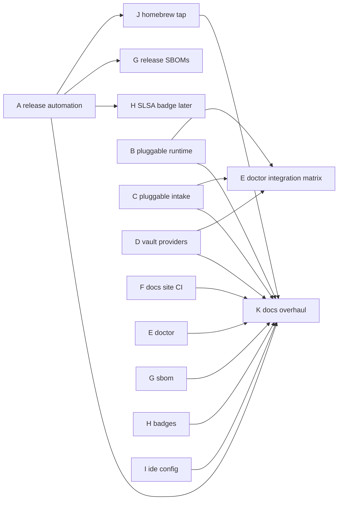

<!-- SPDX-License-Identifier: Apache-2.0 -->
<!-- Copyright (c) 2026 The Koryph Developers -->

# koryph enhancement roadmap — design & plan (2026-07-02)

Eleven enhancements designed against the current codebase (v0.3.0) and July-2026
research (release tooling, docs/badges infrastructure, agent-CLI landscape).
Tracked as beads epics; IDs appended at the end.

---

## Decision summary

| # | Enhancement | Decision |
|---|---|---|
| A | Release automation | **release-please (Release PR) → GoReleaser OSS ≥v2.16 on tag**, same-workflow chaining; cosign `--bundle`, syft SPDX SBOMs, SLSA L3 generic generator |
| B | Pluggable agent runtime | New `internal/runtime` interface + capability flags; Claude adapter extracted first (pure refactor); then Codex → Cursor/Grok Build → Gemini/opencode/Copilot; per-runtime governor pools; runtime-scoped accounts; beads select via `runtime:<name>` + existing `model:` labels |
| C | Pluggable issue intake | `intake.Source` provider interface; GitHub (existing gh CLI) ported, then Linear (GraphQL) and JIRA (REST); provenance moves to bd `--external-ref`; tokens resolvable via the vault layer |
| D | Vault providers | Extend existing argv-template `ProviderTemplates` registry: KeePassXC, OpenBao, HashiCorp Vault, AWS SM, Azure KV, Google SM; validate the shipped 1Password templates |
| E | `koryph doctor` | New subcommand, global + `--project` modes; zombie/stalled detection from governor slots + ledgers; integration matrix with suggestions (capability data comes from B/C/D interfaces) |
| F | Docs publishing | GitHub Actions artifact flow (`configure-pages`/`upload-pages-artifact@v3`/`deploy-pages@v4`), **no gh-pages branch**, `mkdocs build --strict`, Material 9.7.x pinned |
| G | SBOM | `make sbom` via syft (SPDX JSON); release SBOMs via GoReleaser `sboms:`; **skip** go-dependency-submission (GitHub auto-generates Go graphs since Dec 2025) |
| H | Badges | Now: License, CI, Release, Go Reference, REUSE, OpenSSF Scorecard. Later: Codecov, OpenSSF Best Practices, SLSA 3. **Never: Go Report Card (service shut down 2026-07-01)** |
| I | IDE config | `.editorconfig` + `.vscode/settings.json` + `.vscode/extensions.json` |
| J | Homebrew | **Separate `koryph/homebrew-tap` repo** (taps cannot be monorepo subdirs); GoReleaser `homebrew_casks:` (NOT deprecated `brews:`); fine-grained PAT scoped to the tap |
| K | Docs overhaul | Full rewrite + Mermaid diagrams (plain flowchart/sequence/state only — no `C4Context`/`architecture-beta`, they do not render on GitHub); **last, depends on all other epics** |

---

## A. Release automation

**Research verdict:** GoReleaser OSS v2.16+ covers 100% of this project's needs
(build matrix, archives, checksums, conventional-commit changelog groups, cosign
keyless, syft SBOMs, homebrew casks, nfpm). None of the required features are
Pro-only. Alternatives rejected: axodotdev `dist` has no Go support and lapsed
governance; semantic-release adds a Node toolchain; plain scripts (status quo)
hand-roll everything GoReleaser gives declaratively.

**Versioning:** release-please action (`release-type: go`) maintains a Release
PR from conventional commits; merging creates tag + GitHub release. Sharp edges
handled by design:

- `version-file` is **ignored** for the Go strategy → keep `const Engine` in
  `internal/version/version.go` as source of truth via `extra-files` +
  generic-updater `// x-release-please-version` annotation (Engine is consulted
  at runtime for project `engine_version` compat, so ldflags-only is not enough).
- Tags pushed with the default `GITHUB_TOKEN` do **not** trigger downstream
  tag workflows → run GoReleaser **in the same workflow**, gated on
  `steps.release.outputs.release_created`, checkout `outputs.tag_name` with
  `fetch-depth: 0`. No PAT needed for releasing.
- Repo rulesets: release-please commits via the GitHub API are signed by
  GitHub's web-flow key (passes signatures-everyone); DCO handled with the
  action's `signoff` input. Validate both on a throwaway PR before cutover.
- GoReleaser v2.16 **immutable releases**: all assets must be uploaded in the
  one tag-triggered run — no post-publish mutation (constrains SLSA job to the
  same workflow, which the generic generator supports as a second job).

**`.goreleaser.yaml`:** builds darwin/linux × amd64/arm64 (matches current
release.yml), `-ldflags -X` version injection, archives (`formats:` — new v2.6
key), checksums, changelog `groups` by conventional-commit type, `signs:` with
`cosign sign-blob --bundle=${artifact}.sigstore.json --yes` on the checksum
file (the single-bundle pattern replaced separate `.sig`/`.pem`), `sboms:`
(syft, SPDX JSON, per-archive). `make release-snapshot` runs
`goreleaser release --snapshot --clean` locally.

**SLSA:** second job exports base64 hashes of `checksums.txt` →
`slsa-framework/slsa-github-generator/.github/workflows/generator_generic_slsa3.yml`
(reusable) attaches Build L3 provenance. ~30 lines; use the **generic** generator
(the Go-native builder replaces the build and cannot compose with GoReleaser).

Retire the hand-rolled `release.yml` after one successful parallel run.

## B. Pluggable agent runtime

**Current coupling (from code audit):** `claude` is invoked from three sites —
`internal/dispatch/cli.go` (launch.sh, `-p --agent … --permission-mode dontAsk
--model … --output-format stream-json`), `internal/review/review.go`
(`--permission-mode plan`), `internal/stage/stage.go`. Claude-specific artifacts:
`.claude/settings.json` merge (internal/rules), slash commands
(internal/commands), personas (`agents/` → `.claude/agents`), hooks
(`CLAUDE_PROJECT_DIR`), accounts (`CLAUDE_CONFIG_DIR`, `.claude.json`
oauthAccount), quota (ccusage + `~/.claude/projects/*.jsonl`), modelroute tiers
(strings passed to `--model`).

**Research verdict (July 2026 landscape):** every serious runtime supports
headless prompt-in/edits-in-cwd/text-out with a full-auto flag; the only truly
portable result contract is **final message + exit code + git diff**. Hooks,
settings.json permission merging, personas, and slash commands are
Claude-specific — model them as **capability flags**, not required interface.
AGENTS.md has effectively won as the cross-runtime instruction file (Codex,
Cursor, Grok Build, Copilot, opencode, Amp read it natively; Gemini can be
pointed at it via `context.fileName`).

**Design:**

```go
// internal/runtime
type Runtime interface {
    Name() string
    Detect(ctx) (Info, error)        // binary on PATH + --version
    AuthCheck(ctx, Account) error     // cheap, no tokens burned
    Capabilities() Caps               // JSONStream, Personas, Hooks, Resume,
                                      // EffortFlag, BudgetFlag, Sandbox, ModelSelect …
    Command(spec DispatchSpec) (Cmd, error)   // argv+env for headless dispatch
    ParseEvents(r io.Reader) (<-chan Event, error) // normalize to ledger envelope
    InstructionFile() string          // CLAUDE.md | AGENTS.md | GEMINI.md …
    AccountEnv(Account) []string      // CLAUDE_CONFIG_DIR | CODEX_HOME | COPILOT_HOME …
}
```

Adapter matrix (headless flag / full-auto / auth / multi-account hook):

| Runtime | Headless | Full-auto | Multi-account |
|---|---|---|---|
| claude | `-p` | `--permission-mode dontAsk` | `CLAUDE_CONFIG_DIR` (existing) |
| codex | `codex exec` | `--sandbox workspace-write` + `approval_policy=never` | `CODEX_HOME` |
| cursor | `cursor-agent -p` | `--force` (+ workspace pre-trust) | `CURSOR_API_KEY` |
| grok (Grok Build) | `grok -p` / `exec` | `--always-approve` | none documented (beta) |
| gemini | `-p` | `--approval-mode yolo` | API-key env (OAuth needs browser) |
| copilot | `copilot -p` | `--allow-all-tools` | `COPILOT_HOME` + token env |
| opencode | `opencode run` | `--auto` | `OPENCODE_CONFIG_DIR` |

Known worktree gotchas encoded per adapter: Codex sandbox must add the main
repo's `.git` dir as a writable root (linked worktrees point outside the
sandbox); Cursor `-p` needs a hard timeout (history of hangs); Grok Build
subagents spawn their **own** worktrees (must be disabled or contained); Gemini
exit code 53 = turn-limit ⇒ "incomplete", not "error".

**Selection & routing:** bead labels `runtime:<name>` (analogous to existing
`model:` grammar); project `default_runtime` + `runtimes:{}` block in
koryph.project.json; modelroute becomes runtime-namespaced (per-runtime
stage-default tables; the Fable allowlist guard stays Claude-side; equivalent
ceiling models per runtime). Beads remain **one board across all runtimes**.

**Governor:** slots gain a `runtime` field; `governor.json` schema v2:
`{caps: {default: N, per_runtime: {claude: 4, codex: 2, …}}}`. Fair-share
runs **within each runtime pool** (a Codex stampede can't starve Claude slots).
Migration reads v1 `max_global_agents` as `caps.default`.

**Accounts/quota:** registry `Record` gains runtime-scoped account profiles
(config-dir/env/identity per runtime); `account.VerifyExpected` becomes a
runtime method (claude: `.claude.json` oauthAccount; codex: `auth.json`; …).
Quota stays fail-closed for Claude (ccusage), **advisory/capability-gated**
elsewhere until per-runtime usage sources exist.

**Ecosystem assets:** emit **AGENTS.md as the canonical per-worktree
instruction file** (CLAUDE.md already coexists); per-runtime installers are
capability-gated — hooks/settings merge only for Claude; for runtimes without
hooks, containment relies on worktree isolation + merge-time protected-path
refusal (already enforced in internal/merge — document this trust delta).

**Phasing:** (1) interface + Claude adapter extraction (behavior-identical,
refactor-core); (2) selection/routing/config plumbing; (3) governor pools +
accounts; (4) Codex adapter (reference second impl); (5) Cursor + Grok Build
(explicitly requested); (6) Gemini/opencode/Copilot fast-follow. All engine-core
beads carry `refactor-core` (authored on main by the orchestrating session).

## C. Pluggable issue intake

Current `internal/intake` is GitHub-only via `gh` CLI (trigger label →
planning bead, `gh-<n>` label dedupe, `no-dispatch` mandatory). Design:

- `intake.Source` interface: `List(ctx, Query) ([]ExternalIssue, error)`,
  `Comment(ctx, ID, string) error`, `Provenance(ID) string`.
- Provenance moves to bd `--external-ref` (e.g. `gh-9`, `linear-ABC-123`,
  `jira-PROJ-42`) — the field exists in bd 1.0.5; keep the `gh-<n>` label for
  backward compat during migration.
- Providers: **github** (port existing, gh CLI, no token handling), **linear**
  (GraphQL, `LINEAR_API_KEY`), **jira** (REST v3, email+API-token). Tokens
  resolvable via env var **or vault reference** (reuse D's provider layer).
- Project config: `intake: [{provider, source, trigger, mapping{priority,type},
  comment_back}]` — a list, so one project can ingest from several trackers.
- Invariants preserved: ingested beads always get `intake` + `no-dispatch`;
  humans promote to dispatchable work.

## D. Vault providers

`internal/signing/vault.go` already has the right shape: argv-template
`ProviderTemplates{Fetch, AgentLoad, View, ViewByTitle, LoginHint}` in
`~/.koryph/vault.json`, with protonpass/onepassword/file/command shipped.
Work is mostly additive templates + verification + docs:

- **KeePassXC** `keepassxc-cli show/attachment-export` (note: interactive DB
  password unless key-file/YubiKey — document headless constraints).
- **OpenBao** `bao kv get -field=…` / **HashiCorp Vault** `vault kv get`
  (same template shape, different binary).
- **AWS** `aws secretsmanager get-secret-value --query SecretString`,
  **Azure** `az keyvault secret show --query value`,
  **GCP** `gcloud secrets versions access latest --secret=…`.
- Validate the existing 1Password (`op`) templates end-to-end.
- Generalize fetch so C (intake tokens) and future consumers can pull generic
  secrets, not just SSH keys; secrets stay memory-only (existing invariant).
- Philosophy unchanged: shell out to official CLIs, zero new Go deps.

## E. `koryph doctor`

Global mode (`koryph doctor`): ~/.koryph sanity; required binaries
(git, bd + each **detected** runtime via B's `Detect`/`AuthCheck`); registry
records parse; governor config + **zombie leases** (slot files whose PID is
dead → offer `--fix` cleanup); quota calibration state; vault provider
reachability. Project mode (`--project`): superset of `koryph validate`
(reuse `onboard.Validate` checks) + stalled runs (phase age from ledger),
orphaned worktrees, hooks/settings wiring, signing status.

**Integration matrix** (the "what could add value" ask): a table of
implemented-vs-configured integrations with one-line suggestions —
"signing: not configured → koryph signing setup", "intake: github available,
linear not configured", "runtimes: claude ✓ (authed), codex ✗ (binary found,
not logged in)". Powered by the B/C/D provider registries, so this lands after
their interfaces exist. `--json` output + exit codes (0 ok / 1 warnings /
2 errors) for CI use.

## F. MkDocs → GitHub Pages

Artifact flow (GitHub's recommended model): build job runs
`mkdocs build --strict` with pip-cached `docs/requirements.txt` (pin
`mkdocs-material 9.7.x` — **maintenance mode** since 9.7.0, plan a Zensical
check-in ~Q4 2026), then `configure-pages` → `upload-pages-artifact@v3` →
`deploy-pages@v4` with only `pages: write` + `id-token: write` (scores better
on Scorecard Token-Permissions than gh-deploy's `contents: write`). No
gh-pages branch. Skip `mike` versioning until 1.0. Do **not** add
mkdocs-minify-plugin (strips mermaid `<pre>` on 9.7.x). Human step: repo
Settings → Pages → Source = GitHub Actions.

## G. SBOM

- `make sbom`: `syft . -o spdx-json=dist/koryph-<ver>.spdx.json` — same tool
  locally and in release (syft is GoReleaser's default and the de-facto Go
  standard; cyclonedx-gomod only if a consumer demands CycloneDX fidelity).
- Release SBOMs: GoReleaser `sboms:` (one per archive, auto-attached) — lands
  with A's config.
- **Not doing:** actions/go-dependency-submission — GitHub auto-generates Go
  dependency graphs via Dependabot since Dec 2025.

## H. Badges & OSS posture

Adopt now (one README row): License → CI (`ci.yml` badge) → Release →
Go Reference (pkg.go.dev) → REUSE → OpenSSF Scorecard.

- **REUSE:** SPDX headers already enforced ⇒ remaining work is mechanical:
  `LICENSES/Apache-2.0.txt`, `REUSE.toml` globs for go.sum/fixtures,
  `reuse lint` in CI (fsfe/reuse-action), register at api.reuse.software.
- **Scorecard:** ossf/scorecard-action on cron+push; job-level `id-token:
  write` + `publish_results: true` (enables the badge), `security-events:
  write` for SARIF. Supporting hygiene in the same epic: pin all action refs
  by SHA, add `.github/dependabot.yml` (gomod + github-actions), govulncheck
  workflow. Realistic starting score 5–7; koryph's signing posture helps.
- Later: Codecov (when the number flatters), OpenSSF Best Practices
  self-certification (a few hours; also lifts Scorecard), SLSA 3 static badge
  (after A's provenance job). **Never:** Go Report Card — shut down 2026-07-01.

## I. IDE config

`.editorconfig` (Go = tabs, md/yaml = 2-space, LF, final newline, trim
trailing ws — matching pre-commit hooks so editors and hooks agree);
`.vscode/settings.json` (gofmt on save, organize imports, ruler, files.eol);
`.vscode/extensions.json` (golang.go, editorconfig, mermaid preview, yaml).
Update docs/ide-integration.md. `.vscode/` is not a protected path.

## J. Homebrew

**Separate `koryph/homebrew-tap` repo** — settled by research: taps cannot
be monorepo subdirectories (formulae must live at tap-repo root/Formula/Casks),
and pushing generated casks into koryph would collide with protected paths
and the signed-commit ruleset. GoReleaser `homebrew_casks:` (the `brews:`
formula section is deprecated since v2.10, fully in v2.16; casks now work on
Linuxbrew too). Cross-repo push needs a fine-grained PAT (contents: write on
the tap only) as `HOMEBREW_TAP_GITHUB_TOKEN`. Include the documented `xattr`
quarantine post-install hook for unsigned macOS binaries. Users:
`brew install koryph/tap/koryph`. homebrew-core is out of reach for now
(≥75 stars / 30 forks notability bar) — revisit organically.

## K. Documentation overhaul (final; depends on all)

- Architecture: refresh docs/architecture.md with plain-Mermaid diagrams —
  C4-style context/container views via flowchart subgraphs, wave-loop sequence
  diagram, bead/slot state diagrams, runtime-plugin component map. (Mermaid
  `C4Context` and `architecture-beta` explicitly avoided: broken/unsupported on
  GitHub's renderer as of mid-2026.)
- User guide: full clarity/conciseness edit + new chapters (runtimes, intake
  providers, vault matrix, doctor); developer guide: packages.md regen against
  the post-B package layout, testing, releasing rewrite.
- README rewrite (badges from H, quickstart, diagram) + index.md + nav audit +
  stale-content purge; `mkdocs build --strict` as the acceptance gate.

---

## Sequencing



Parallel-friendly: A, B1–B3, C, D, F, G1, H, I can all start immediately.
`refactor-core` beads (engine core, `.github/`, `Makefile`) are authored on
main by the orchestrating session, never loop-dispatched. Human-action beads
are labeled `no-dispatch`.

## Human actions required (labeled no-dispatch)

1. Create `koryph/homebrew-tap` repo + fine-grained PAT (contents: write,
   tap repo only) → repo secret `HOMEBREW_TAP_GITHUB_TOKEN`.
2. Repo Settings → Pages → Source = "GitHub Actions".
3. Validate release-please PR passes the signatures/DCO rulesets (bot commits
   are GitHub-web-flow-signed; `signoff` input covers DCO) before deleting the
   legacy release.yml.
4. Register the repo at api.reuse.software; later: OpenSSF Best Practices
   questionnaire; Codecov account when coverage is presentable.

## Beads (filed 2026-07-02)

| Epic | ID | Children |
|---|---|---|
| A release automation | koryph-q35 | .1 goreleaser.yaml+snapshot, .2 release-please chain, .3 SLSA, .4 HUMAN ruleset validation |
| B pluggable runtime | koryph-v8u | .1 interface, .2 claude extraction, .3 selection/routing, .4 governor v2, .5 accounts/quota, .6 codex, .7 cursor+grok, .8 gemini/opencode/copilot, .9 AGENTS.md+installers |
| C pluggable intake | koryph-0wv | .1 interface+github, .2 linear, .3 jira, .4 multi-source config+docs |
| D vault providers | koryph-fr3 | .1 generic-secret+1password, .2 keepassxc/openbao/vault, .3 aws/azure/gcp, .4 provider-matrix docs |
| E doctor | koryph-8qf | .1 global+zombies+--fix, .2 project mode+stalled runs, .3 integration matrix |
| F docs site | koryph-c6j | .1 docs.yml workflow, .2 HUMAN pages source |
| G sbom | koryph-vgv | .1 make sbom, .2 release SBOM verify+docs |
| H badges | koryph-8uk | .1 REUSE, .2 scorecard/pins/dependabot/govulncheck, .3 README row, .4 HUMAN later-badges |
| I ide config | koryph-5ov | (single task) |
| J homebrew | koryph-1hr | .1 HUMAN tap repo+PAT, .2 homebrew_casks config |
| K docs overhaul | koryph-zui | .1 architecture+diagrams, .2 user guide, .3 developer guide, .4 README+nav — each gated on every other epic's leaf tasks |

`refactor-core` (orchestrating session authors on main): q35.1-.3, v8u.1-.5,
c6j.1, vgv.1, 8uk.1-.2. `no-dispatch` (human): q35.4, c6j.2, 8uk.4, 1hr.1.
Ready frontier at filing: 22 (A1, B1, C1, D1, E1, F1, F2, G1, H1, H2, H4, I,
J1 + unblocked epics).
