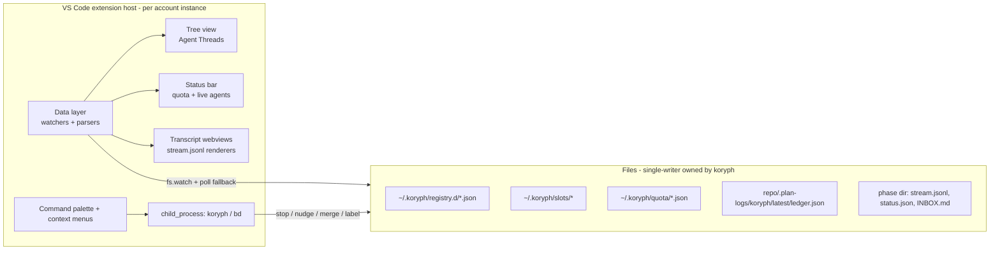

<!-- SPDX-License-Identifier: Apache-2.0 -->
<!-- Copyright (c) 2026 The Koryph Developers -->

# koryph VS Code extension — design (2026-07-03)

> **User guide:** [VS Code extension](../user-guide/vscode-extension.md) —
> installation, command reference, settings, and build/side-load instructions.

A VS Code extension that makes running koryph waves *visible and steerable*
from the editor: every agent thread across every project, its live line of
thought, one-click worktree/diff navigation, quota burn, and project config
editing — working correctly across the per-account multi-instance VS Code
setup documented in [ide-integration.md](../ide-integration.md).

Grounded in the current observability surfaces: koryph is **entirely
file + signal based** (no daemon, no socket, no event bus). The extension is
therefore a *file-watching client + CLI shell-out*, never a server peer.

---

## Decision summary

| # | Question | Decision |
|---|---|---|
| 1 | Where does the extension live | In-repo at `ide/vscode/` (TypeScript, esbuild bundle, zero runtime deps beyond the VS Code API). Marketplace publishing is a later, separate bead. |
| 2 | How it learns state | Watch + parse the files koryph already writes: `~/.koryph/registry.d/*.json`, `~/.koryph/slots/*`, `~/.koryph/quota/*.json`, per-project `.plan-logs/koryph/latest/ledger.json`, per-slot `stream.jsonl` / `status.json` / `INBOX.md`. `fs.watch` with a polling fallback; `updated_at` fields are the change signal. |
| 3 | How it acts | Shell out to the `koryph` CLI for every mutation (`stop`, `nudge`, `merge`, `land`, `review-pr`) and to `bd` for label edits. Never signal PIDs directly, never write koryph state files (single-writer discipline: the engine owns `ledger.json`; the CLI owns the rest). Exception: none. |
| 4 | Line-of-thought view | Webview panel per slot rendering `stream.jsonl` incrementally (assistant text, collapsed tool calls, result/cost lines). Multiple panels open side-by-side; a lightweight "Open in terminal" alternative runs `koryph tail --follow`. |
| 5 | Change model mid-run | Honest UX: model is resolved **at dispatch time only** (`modelroute.Resolve`). The command edits the bead's `model:<tier>` label via `bd label` and offers "stop + requeue now" vs "apply on next dispatch". No pretense of live switching. |
| 6 | Multi-window / multi-account | Extension is account-agnostic by construction — it only reads files and shells the CLI, and dispatch resolves accounts from the registry, never from the window env. Per-window scoping: workspace folders are matched to registry `root`s; matching projects are pinned, others collapse behind a "Other projects" toggle (`koryph.showAllProjects`). Each per-account VS Code instance (`--user-data-dir`) gets its own extension host and settings, so this works unchanged. |
| 7 | Quota display | Status bar item per involved account: governor level (ok/warn/drain/stop) + window/weekly spend. Refresh is *slow and async* (default 5 min, configurable) because `quota.Snapshot` may invoke `ccusage` (40 s timeout); reads cached `~/.koryph/quota/<account>.json` for ceilings between snapshots. Needs `koryph quota show --json` (gap bead). |
| 8 | Config editing | Ship a JSON Schema for `koryph.project.json` (contributed via `jsonValidation`), plus a "Koryph: Edit Project Config" command. Surface the load-bearing caveat inline: **a running engine reads project config once at run start** — edits apply on next `koryph run`. |
| 9 | Worktree navigation | Per-slot commands: Open Worktree (new window / add to workspace / reveal), Show Diff (`base_commit…HEAD` via the built-in Git extension timeline/diff APIs), Open Branch in terminal. Paths come straight from `ledger.Slot.worktree` / `.branch` / manifest `base_commit`. |
| 10 | Koryph-core gaps to fill | Three small CLI/engine beads unblock the UI: (a) `koryph quota show --json`; (b) `koryph board --json` already exists — extension uses it for cross-project enumeration instead of reimplementing registry+ledger fan-out where convenient; (c) publish the project-config JSON Schema from the Go structs so it cannot drift. Live per-token cost is explicitly out of scope for koryph core — the extension parses `stream.jsonl` itself. |

---

## 1. Architecture



**Data layer** (`src/data/`): one `RegistryWatcher` (project records), one
`LedgerWatcher` per visible project (parses `ledger.Run` schema v2), one
`StreamReader` per open transcript (byte-offset incremental JSONL parse —
the same advance-by-offset approach `koryph tail` uses), one `GovernorReader`
(lease files → live global slot picture), one `QuotaReader`. All schema
types are transcribed into `src/data/schema.ts` with a `schema_version`
guard: unknown versions degrade to raw-JSON display, never crash.

**Single-writer discipline is a hard rule.** The engine is the only writer
of `ledger.json`/`manifest.json`; the extension is read-only on all koryph
state and performs every mutation through the CLI, which already owns
locking, audit (`~/.koryph/audit.jsonl`), and account verification. This is
what keeps the extension safe in the multi-account setup: it can *never*
dispatch, so it can never dispatch on the wrong account.

## 2. Tree view — agent threads

Activity-bar container "Koryph" with one tree:

```text
▸ koryph            run 20260703-091422  running · wave 3 · 2/4 slots
    ● koryph-i2n   running   opus   $0.42   feat/koryph-i2n-completions
    ◐ koryph-fr3.1 review    sonnet $0.18   feat/fr3.1-keepassxc
    ✓ koryph-5ov   merged    sonnet $0.11
▸ ncp_roadmap       (no active run)
▹ Other projects (3 hidden)
```

- **Grouping:** project → active run → slots, ordered by `ledger.Slot.updated_at`.
  Projects whose registry `root` matches a workspace folder are pinned to the
  top and expanded; all others live under a collapsible "Other projects" node
  controlled by `koryph.showAllProjects` (default: on when no workspace folder
  matches any registered project, off otherwise). This is the per-window
  project scoping: a work-account window opened on project-A shows project-A's
  wave, with everything else one click away, and the same build of the
  extension behaves correctly in every instance.
- **Slot rows** render: status glyph (queued/dispatching/running/stuck/review/
  merge-pending/merged/pr-opened/failed/conflict/blocked), bead id + title
  (from `bd show --json`, cached), model tier, `cost_usd` (completed) or
  "~streaming" (running), branch. Tooltip: persona, account profile, verified
  identity, attempts, `status.json` step/pct *labeled as agent-reported and
  possibly stale* (it is agent-authored, not guaranteed).
- **Badges:** tree view badge = count of live agents across visible projects
  (from governor lease files — cheaper and more truthful than ledger scan).

## 3. Slot commands (context menu + palette)

| Command | Mechanism | Notes |
|---|---|---|
| Stop (graceful) | `koryph stop --project <id> <phase>` | SIGTERM to process group; confirm dialog shows uncommitted-work note |
| Stop (force) | `koryph stop --force …` | destructive-styled confirm |
| Stop whole run | `koryph stop --project <id>` all live slots | |
| Nudge… | input box → `koryph nudge --project <id> <phase> "text"` | appends INBOX.md + bd comment |
| Change model… | quick-pick haiku/sonnet/opus(/fable if allowlisted) → `bd label` update, then choice: "Stop + requeue now" (runs stop; engine requeue re-resolves) or "Apply next dispatch" | honest about dispatch-time resolution |
| Open transcript | webview panel (§4) | multiple panels allowed |
| Tail in terminal | integrated terminal running `koryph tail --project <id> <phase> --follow` | zero-parse fallback |
| Open worktree | quick-pick: new window / add to workspace / reveal in finder | path = `slot.worktree` |
| Show diff vs base | Git extension API diff of `manifest.base_commit…branch` in the worktree | falls back to `git diff` terminal |
| Open PR | `pr-opened` slots: open PR URL | |
| Merge / Land | `koryph merge` / `koryph land` in terminal (interactive output visible) | |
| Show bead | output channel with `bd show <id>` | |

## 4. Transcript panels — the line of thought

`KoryphTranscriptPanel` (one per slot, any number open, `retainContextWhenHidden`):

- Incremental parse of `stream.jsonl` (claude `--output-format stream-json
  --include-partial-messages`): assistant deltas render as flowing text;
  `tool_use`/`tool_result` collapse to one-line chips (expandable); the final
  `result` event renders a cost/duration footer. Unknown event types render
  as collapsed raw JSON — forward-compatible with the pluggable-runtime epic,
  which standardizes an event envelope (`koryph-v8u.1`); when that lands the
  parser targets the envelope instead of claude's native stream.
- Follow-mode toggle (auto-scroll), pause, and a "running spend" estimate
  summed from usage fields in stream events (labeled approximate; the ledger's
  authoritative `cost_usd` appears only at completion).
- Header strip: bead, status, model, attempts, worktree shortcut, stop/nudge
  buttons — the panel is a complete cockpit for one agent.
- `stderr.log` and `session.log` are available as tabs within the panel
  (plain tail rendering; `session.log` content is persona-defined).

## 5. Quota / subscription status

- Status bar item per account that owns a *visible* project with an active
  run: `⚡ personal 62% 5h · 41% wk` with governor-level coloring
  (ok/warn ≥0.80/drain ≥0.90/stop ≥0.95). Click → quick-pick with full
  snapshot + "Calibrate…" hint (points at `/koryph-calibrate`).
- Refresh loop: every `koryph.quotaRefreshMinutes` (default 5) run
  `koryph quota show --json` **async with the documented 40 s worst case**;
  between snapshots, show ceilings from `~/.koryph/quota/<account>.json`
  (cheap read) and mark data age. Never block the UI on ccusage.

## 6. Project configuration editing

- `koryph.project.schema.json` generated from the Go `project.Config` structs
  (small `go generate` emitter — schema lives in `docs/schema/`, wired into
  the extension's `jsonValidation` contribution and usable by any editor via
  `$schema`). Single source of truth: the structs; CI check that the emitted
  schema is current (gate-adjacent, same pattern as gofmt check).
  **Delivered (ext.2):** [`docs/schema/koryph.project.schema.json`](../schema/koryph.project.schema.json),
  emitted by `go generate ./internal/project` (`internal/project/gen`) and
  drift-guarded by `TestSchemaNoDrift` in the standard `go test ./...` gate — no
  Makefile/CI change, so protected paths stay untouched.
- "Koryph: Edit Project Config" opens `koryph.project.json` with schema
  validation, hover docs per field, and a persistent editor banner: *"Applies
  on next `koryph run` — the running engine loaded config at run start."*
  Registry-record edits (account, models, billing guard) are pointed at the
  `koryph project` CLI rather than raw file edits (those files are
  git-committed by the store and must not be hand-edited).

## 7. Multi-instance correctness (the account model)

The existing two-layer isolation (direnv `CLAUDE_CONFIG_DIR` + per-account
`code()` instances) is untouched. The extension inherits whatever window it
loads in, and *that is fine* because:

1. It never launches `claude` and never reads/writes `CLAUDE_CONFIG_DIR`.
2. Every dispatch-adjacent action goes through `koryph`, which scrubs ambient
   env and rebuilds from the registry record, failing closed on identity
   mismatch.
3. All state files it watches are account-neutral (`~/.koryph`, repo
   `.plan-logs/`) and readable from any instance.

So the same extension build runs in the personal and work instances; only the
workspace-folder pinning differs, which is exactly the desired "each window
shows its project's koryph execution" behavior.

## 8. Out of scope (deliberately)

- **No event bus / daemon in koryph core.** File watching is sufficient at
  koryph's write cadence (poll tick ≈ 45 s, atomic writes). Revisit only if
  watcher latency proves inadequate in practice.
- **No live model hot-swap** — contradicts dispatch-time resolution; the
  label-edit + requeue flow is the truthful version.
- **No web/remote UI, no marketplace publish** in v1 (side-load via `vsix`;
  publish is a follow-up once telemetry/licensing questions are settled).
- **No cross-project runs index file** (`~/.koryph/runs.jsonl` is declared
  but unwritten); `koryph board --json` + registry fan-out covers v1.

## 9. Build, test, CI

- `ide/vscode/`: `package.json` (engines.vscode pinned), `esbuild` bundle,
  `@vscode/test-electron` + mocha for unit tests (data-layer parsers get
  fixture-driven tests using real ledger/stream samples checked into
  `ide/vscode/src/test/fixtures/`), `vsce package` target.
- Makefile targets `ext-build` / `ext-test` (Node toolchain optional: targets
  no-op with a notice when `node` is absent so `make gate` stays green on
  Go-only machines). CI gets a separate workflow job for the extension
  (protected-path change — orchestrator/human authored).
- Footprint: extension beads carry a dedicated area token so they parallelize
  freely against Go work (`area_map` addition — orchestrator-authored).

## Bead decomposition

| Bead | Scope | Area / model |
|---|---|---|
| ext.1 | `koryph quota show --json` (+ tests, quota user-guide note) | cli / sonnet |
| ext.2 | JSON Schema emitter for `project.Config` + `docs/schema/` + drift check target | cli / opus |
| ext.3 | Extension scaffold: `ide/vscode/` project, data layer (registry/ledger/governor/quota readers + watchers, schema.ts, fixtures, unit tests) | ide / opus |
| ext.4 | Tree view (grouping, pinning, badges, show/hide other projects) + status bar quota item | ide / opus |
| ext.5 | Transcript webview: stream.jsonl incremental renderer, multi-panel, follow mode, stderr/session tabs | ide / opus |
| ext.6 | Slot commands: stop/nudge/change-model/worktree/diff/merge/land/PR + confirmations | ide / opus |
| ext.7 | Config editing UX: jsonValidation wiring, edit command, run-start caveat banner. Consumes the schema delivered by ext.2 at [`docs/schema/koryph.project.schema.json`](../schema/koryph.project.schema.json) (generated from `project.Config`, drift-checked by `go test`; see [projects-and-accounts.md → Editor validation](../user-guide/projects-and-accounts.md)). | ide / sonnet |
| ext.8 | Makefile `ext-*` targets + docs: new user-guide chapter "VS Code extension"; update ide-integration.md | ide+docs / sonnet |

Dependencies: ext.3 → ext.4/5/6/7 (parallel after scaffold); ext.1, ext.2
independent; ext.8 last. CI workflow job and `area_map` addition are
orchestrator-authored (protected paths).
