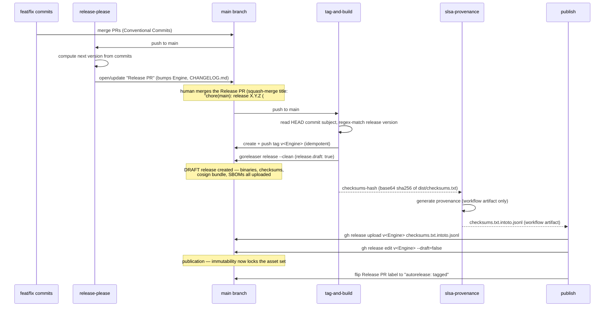

<!-- SPDX-License-Identifier: Apache-2.0 -->
<!-- Copyright (c) 2026 The Koryph Developers -->

# Releasing & versioning

Koryph follows [Semantic Versioning 2.0.0](https://semver.org).

## Semver policy

| Change | Version component |
|---|---|
| Breaking change to the project JSON contract, CLI flags, or engine API | **MAJOR** |
| New backward-compatible feature or engine capability | **MINOR** |
| Bug fix, documentation, internal refactor | **PATCH** |

Pre-1.0 rule: minor bumps may carry breaking changes while the project is
`0.x`. Document every breaking change in the commit body and in the release
notes (release-please lifts this straight from Conventional Commit
`BREAKING CHANGE:` footers — see below).

## Release automation overview

Releases are cut by **release-please**, which manages *only* the Release PR
(version bump, `CHANGELOG.md`). Tagging and the GitHub release itself belong
to the workflow and **GoReleaser**, under a draft-until-complete lifecycle:
the release stays a draft — invisible, and still mutable — until every asset
has uploaded, and is published only as the pipeline's very last step. The
only human action is *deciding when to merge the Release PR*.



The final label flip matters more than it looks: release-please marks merged
Release PRs `autorelease: pending` and **aborts every subsequent run** while
one exists untagged. Because the train — not release-please — owns tagging
and the GitHub release, the publish job must flip the label itself, or the
next release cycle never opens a Release PR (found the hard way after
v0.5.0: a day of runs silently reported success while aborting).

All four jobs live in one reusable workflow, `.github/workflows/
release-train.yml`, which koryph's own `.github/workflows/release-please.yml`
calls via `workflow_call` (see "Reusable release-train workflow" below). The
job names, ordering, and behavior described in this doc are unchanged by that
extraction — this is the same pipeline validated on v0.4.0/v0.4.1/v0.5.0,
just relocated so other koryph-managed projects can reuse it.

### Why one workflow, not two

Tags created by GitHub Actions' default `GITHUB_TOKEN` do **not** trigger
other `on: push: tags` workflows (a deliberate anti-recursion guard in
GitHub Actions). A separate, tag-triggered GoReleaser workflow — the old
`release.yml` shape — would therefore never fire off a tag this pipeline
creates. Instead, `tag-and-build` runs as a second job in the *same*
push-to-main-triggered workflow run, and creates the tag itself. No PAT is
needed for this part.

### Why release-please no longer owns the GitHub release

On the first real release (v0.4.0), release-please tagged and **published**
its GitHub release as soon as its own job ran; the `goreleaser` job in the
same run then tried to attach binaries/checksums/SBOMs to that already-
published release and every upload failed with HTTP 422 `Cannot upload
assets to an immutable release` — this repo has immutable releases enabled,
and *publication*, not creation, is what locks the asset set. There is no
release-please input that defers publication of the release it creates —
only whether it creates one at all. So instead:

- `release-please-config.json` sets `"skip-github-release": true` —
  release-please still maintains the Release PR (version, `CHANGELOG.md`,
  the `Engine` annotation) but creates neither a tag nor a release.
  release-please's own docs (`docs/manifest-releaser.md` in
  `googleapis/release-please`) say the flag is release-*creation*-only —
  "Release-Please still requires releases to be tagged, so this option
  should only be used if you have existing infrastructure to tag these
  releases" — implying release-please may still tag internally even with
  this flag set. Whether it does or not, `tag-and-build`'s tag step is
  idempotent (below), so either behavior is safe.
- **Verify-don't-assume note:** whether `googleapis/release-please-action`'s
  `release_created`/`tag_name` outputs still populate under
  `skip-github-release: true` is **not documented either way** — the
  action's README doesn't say, and the action's own issue tracker
  (`googleapis/release-please-action#1034`) has an open, unresolved question
  asking exactly this. Rather than gamble on undocumented behavior, this
  pipeline does not read those outputs at all: `tag-and-build` detects a
  release-PR merge itself, from the HEAD commit subject.
- `tag-and-build` reads `git log -1 --format=%s` and matches it against
  `^chore\(main\): release ([0-9]+\.[0-9]+\.[0-9]+)`. This is deliberately
  anchored only at the start (no trailing `$`) because GitHub's squash-merge
  produces a title of the shape `chore(main): release X.Y.Z (#N)` — the
  `(#N)` PR-number suffix must not break the match. Demonstrated against the
  real v0.4.0 squash title:
  ```
  $ subject="chore(main): release 0.4.0 (#5)"
  $ [[ "$subject" =~ ^chore\(main\):\ release\ ([0-9]+\.[0-9]+\.[0-9]+) ]] && echo "${BASH_REMATCH[1]}"
  0.4.0
  ```
  A non-release commit subject (e.g. `fix(ci): trailing newline in
  .beads/config.yaml`) does not match, confirmed the same way.
- `tag-and-build` then creates and pushes the annotated tag `v$VERSION`
  itself — idempotently: if the tag already exists it verifies the existing
  tag points at HEAD (and fails loudly if it points anywhere else), rather
  than assuming release-please either did or didn't get there first.
- GoReleaser then runs at that tag with `release.draft: true`
  (`.goreleaser.yaml`) and creates the GitHub release **as a draft**,
  uploading binaries, `checksums.txt`, the cosign bundle, and per-archive
  SBOMs to it. Uploads to a draft are unaffected by immutable releases —
  only *publishing* locks the asset set — so this is the one place all
  build-time assets land in a single upload window, satisfying GoReleaser
  `>=2.16`'s **immutable releases** model. `release.mode: keep-existing` is
  dropped: there is no longer a pre-existing release to keep notes from
  (GoReleaser's own grouped changelog, see `changelog:` in
  `.goreleaser.yaml`, becomes the release body), and `keep-existing` is the
  documented default anyway — it only takes effect when a release already
  exists for the tag.
- `slsa-provenance` (the SLSA generic generator) runs with
  `upload-assets: false`. **Verify-don't-assume note:** uploading by tag
  targets the API for a *published* release addressed by tag; a draft
  release is not resolvable that way, so provenance is generated as a
  workflow artifact only (name: `checksums.txt.intoto.jsonl`, set via
  `provenance-name` — the generic generator's README documents that the
  provenance is always produced as a workflow artifact regardless of
  `upload-assets`, and is additionally uploaded to a release only when that
  input is `true`).
- `publish` downloads that workflow artifact
  (`actions/download-artifact`, matching the `provenance-name` above),
  attaches it to the still-draft release with `gh release upload v$VERSION
  checksums.txt.intoto.jsonl`, and only then runs `gh release edit v$VERSION
  --draft=false`. **Verify-don't-assume note:** `gh`'s own manual
  (`gh_release_upload`, `gh_release_edit`) confirms both commands address a
  release by `<tag>` and that this works for drafts — `gh_release_edit`'s
  worked example is literally `gh release edit v1.0 --draft=false` to
  "Publish a release that was previously a draft". Since `tag-and-build`
  creates the real git tag *before* GoReleaser ever runs, the draft
  GoReleaser creates carries that exact tag name from the start (not
  GitHub's placeholder `untagged-*` shape used for drafts with no git tag
  yet), so addressing it by `v$VERSION` throughout is unambiguous.
  Publication is the deliberate last step of the entire pipeline — nothing
  is ever uploaded after it.

## `internal/version.Engine`

The single source of truth for the current engine version is still the
constant `Engine` in `internal/version/version.go`:

```go
const Engine = "0.3.0" // x-release-please-version
```

**Sharp edge:** release-please's `release-type: go` strategy (used here)
**ignores `version-file` entirely** — it has no built-in notion of a Go
version constant to bump. Instead, `release-please-config.json` lists
`internal/version/version.go` under `packages["."]["extra-files"]`, which
invokes release-please's **generic updater**: it scans the file for a line
carrying the `// x-release-please-version` comment and rewrites the quoted
version string on that exact line. Do not remove the annotation or move the
constant off that line — release-please will silently stop bumping it if you
do (there is no linter for this: it just fails quietly).

No other file hard-codes the version. `koryph.project.json`'s
`engine_version` is a compatibility *floor*, not the current version — it is
edited by hand only when the project needs to require a newer minimum.

## Conventional Commits (drives versioning + changelog)

Every commit must follow Conventional Commits:

```
type(scope): subject in imperative mood, lowercase, ≤72 chars
```

Accepted types: `feat`, `fix`, `docs`, `chore`, `refactor`, `test`, `ci`,
`build`, `perf`, `style`. Breaking changes add `!` after the type or scope
(`feat!:`) and a `BREAKING CHANGE:` footer.

release-please parses these to decide the next version (`feat` → minor,
`fix` → patch, `!`/`BREAKING CHANGE:` → major, pre-1.0 exceptions per the
semver policy above) and to group the changelog it writes into the Release
PR and `CHANGELOG.md`. GoReleaser separately groups the same commits (see
`changelog:` in `.goreleaser.yaml`) for the GitHub release body, since
release-please no longer creates that release itself (see below).

Commits must also carry `Signed-off-by` (DCO) and be cryptographically
signed (see `CONTRIBUTING.md` at the repo root). This applies to *your*
commits; release-please's own commits are covered separately below.

## Cutting a release

1. Land `feat`/`fix`/etc. commits on `main` as usual (normal PR flow).
2. release-please opens or updates a standing **Release PR** — title
   `chore(main): release X.Y.Z`, body a full changelog since the last tag,
   diff bumps `internal/version/version.go`'s `Engine` line and
   `CHANGELOG.md`. It keeps this PR current on every push to `main`; there is
   nothing to run by hand. With `skip-github-release: true` it does this and
   nothing more — no tag, no GitHub release.
3. Review the Release PR like any other PR: check the version bump matches
   the semver policy (a `feat!:` in the batch should have produced a major
   bump, etc.) and skim the generated changelog for accuracy.
4. **Merge it via squash-merge** (the human action that actually cuts the
   release). GitHub's squash-merge produces a commit on `main` titled
   `chore(main): release X.Y.Z (#N)` — this exact title shape is
   load-bearing: `tag-and-build`'s detection step regex-matches it (see
   above). Do not merge the Release PR any other way (rebase-merge or a
   manually retitled squash commit would not match).
5. `tag-and-build` (triggered by that push) detects the release, creates and
   pushes the tag `v<Engine>` (matching the bumped constant exactly), runs
   the green gate, then runs GoReleaser at that tag. GoReleaser creates the
   GitHub release **as a draft** and uploads build artifacts to it —
   binaries, `checksums.txt`, a cosign `--bundle` signature, and per-archive
   SPDX SBOMs.
6. `slsa-provenance` attaches a SLSA Build L3 attestation
   (`checksums.txt.intoto.jsonl`) as a workflow artifact (not yet on the
   release — it's still a draft).
7. `publish` downloads that artifact, uploads it onto the draft release, and
   only then publishes the release (`gh release edit --draft=false`).
   Publication is the last thing that happens in the whole pipeline.
8. Nothing left to do. Verify the release looks right on the Releases page —
   it should appear already published, with every asset attached; there is
   no draft-visible window for anyone watching the Releases page normally.

`make release-snapshot` still works locally for a dry run — it forces
`GORELEASER_CURRENT_TAG` unset, so the version-alignment `before:` hook is
skipped and `snapshot.version_template` is used instead
(`make version-check TAG=vX.Y.Z` is still available on demand if you want to
check `Engine` against an arbitrary tag string).

## DCO on release-please's own commits

release-please's Release PR commits and merge/tag actions are made through
the GitHub API using the workflow's `GITHUB_TOKEN` — there is no `git commit
-s` step to run. `release-please-config.json` sets the top-level `signoff`
field:

```json
"signoff": "github-actions[bot] <41898282+github-actions[bot]@users.noreply.github.com>"
```

which makes release-please append a `Signed-off-by:` trailer matching that
identity to the commits it authors, satisfying the same DCO check `ci.yml`
runs on human PRs (the check is not bot-exempted for this identity — only
`dependabot[bot]` is — so without `signoff` configured, the Release PR would
fail the DCO gate). Commits made via the GitHub API are also automatically
GPG-signed by GitHub's own "web-flow" key, which satisfies the repo's
signed-commit ruleset without any signing key of ours being involved.

## Signed & attested release artifacts (sigstore keyless)

GoReleaser signs `checksums.txt` **keylessly** with cosign — the workflow's
GitHub OIDC identity is the certificate subject (issued by Fulcio, recorded
in the Rekor transparency log). No signing key exists anywhere, so there is
nothing to leak or rotate. The `--bundle` flag produces a single
`checksums.txt.sigstore.json` file (certificate + signature combined) rather
than the older separate `.sig`/`.pem` pair.

To verify a release artifact:

```sh
sha256sum -c --ignore-missing checksums.txt   # binary matches the manifest

cosign verify-blob \
  --bundle checksums.txt.sigstore.json \
  --certificate-identity-regexp 'https://github.com/koryph/koryph' \
  --certificate-oidc-issuer https://token.actions.githubusercontent.com \
  checksums.txt
```

A successful verification proves the manifest was produced by this
repository's release workflow — and the checksum match extends that trust to
the binary itself.

### SBOMs

Every release archive gets a companion SPDX SBOM,
`<archive>.sbom.spdx.json`, generated by syft as part of the same GoReleaser
run (`sboms:` in `.goreleaser.yaml`). `make sbom` produces the equivalent
locally (module-wide, not per-archive) for ad hoc scanning outside a release.

### SLSA Build L3 provenance

The third job in `.github/workflows/release-please.yml`, `slsa-provenance`,
calls
[`slsa-framework/slsa-github-generator`](https://github.com/slsa-framework/slsa-github-generator)'s
**generic** generator (`generator_generic_slsa3.yml`, pinned to `@v2.1.0` —
reusable workflows from this repo must be referenced by tag, not a commit
SHA, per its own documented requirement) as a reusable workflow. It runs
after `tag-and-build`, consuming a base64-encoded sha256 hash of
`dist/checksums.txt` that job exports as a job output (`checksums-hash`).
Unlike the previous design, it does **not** upload to the release itself
(`upload-assets: false`): the release GoReleaser just created is still a
*draft*, and the generator's upload path targets the published-release-by-tag
API, which cannot resolve a draft. Instead the generator produces the
provenance only as a workflow artifact (`checksums.txt.intoto.jsonl`, set via
`provenance-name`), and the fourth job, `publish`, downloads that artifact
with `actions/download-artifact` and attaches it explicitly with `gh release
upload v<Engine> checksums.txt.intoto.jsonl` — *before* it publishes the
release. The generic builder does not build anything itself; it only attests
to the digest it is given, so it composes cleanly with GoReleaser (the
Go-native SLSA builder, by contrast, replaces the build step and cannot be
used here).

The provenance attestation ends up attached to the release as
`checksums.txt.intoto.jsonl`, the same as before — only the upload mechanism
(explicit `gh release upload` in `publish`, rather than the generator's own
`upload-assets: true`) changed. Since `checksums.txt` already carries the
sha256 of every binary and archive in the release, attesting to that one
file's provenance extends to the rest of the release's assets by the same
"checksum match" chain the cosign verification above relies on.

To verify a release artifact's provenance with
[`slsa-verifier`](https://github.com/slsa-framework/slsa-verifier)
(`go install github.com/slsa-framework/slsa-verifier/v2/cli/slsa-verifier@v2.7.1`,
or download a prebuilt binary from its releases page):

```sh
# Download checksums.txt and checksums.txt.intoto.jsonl from the release first.
slsa-verifier verify-artifact checksums.txt \
  --provenance-path checksums.txt.intoto.jsonl \
  --source-uri github.com/koryph/koryph \
  --source-branch main   # NOT --source-tag — see note below
```

**Verified against the real v0.5.0 release, not assumed:** `--source-tag
v0.5.0` **fails** (`invalid ref: ''`). This pipeline tags-and-builds from a
`push: branches: [main]` trigger (`tag-and-build` creates the tag itself,
mid-run — see above), so the SLSA generator's `invocation.configSource.uri`
in the actual provenance is `git+https://github.com/koryph/koryph@refs/heads/main`,
never a tag ref — confirmed by decoding the real
`checksums.txt.intoto.jsonl` DSSE payload from the koryph/koryph v0.5.0
release. `--source-branch main` is the form that matches how this
provenance is actually anchored. The consumer-side verification walkthrough
(every command validated against v0.5.0) lives in
[docs/user-guide/supply-chain.md](../user-guide/supply-chain.md). (The cosign certificate's SAN has the same
shape for the same reason: `https://github.com/koryph/koryph/.github/
workflows/release-please.yml@refs/heads/main` — confirmed against the same
release's `checksums.txt.sigstore.json` certificate. Extracting
`.github/workflows/release-please.yml` into a thin caller of
`release-train.yml` — see "Reusable release-train workflow" below — does
**not** change this SAN: the identity recorded is always the *caller*
workflow's path, and `release-please.yml` keeps its filename across the
extraction specifically to avoid moving that identity out from under
already-published releases.)

A `PASSED: Verified SLSA provenance` result proves `checksums.txt` (and, by
the `sha256sum -c` chain above, every binary it lists) was built by this
repository's GitHub Actions workflow at the claimed tag — Build Level 3,
non-forgeable provenance, not just a keyless signature.

## Reusable release-train workflow

(koryph-0vf.3) The four jobs above live in `.github/workflows/
release-train.yml`, a `workflow_call` reusable workflow, rather than
directly in `release-please.yml`. This lets any koryph-managed project opt
into the same release infrastructure regardless of language or build tool
(see `docs/designs/2026-07-release-train.md` for the design). koryph's own
`.github/workflows/release-please.yml` is the first caller and is
byte-behavior-identical to the pipeline validated on v0.5.0 — it just
forwards koryph's values into the reusable workflow's inputs:

```yaml
jobs:
  release:
    permissions:
      contents: write
      pull-requests: write
      id-token: write
    uses: ./.github/workflows/release-train.yml
    with:
      release_type: "go"
      extra_files: "internal/version/version.go"
      artifacts_dir: "dist"
      build_mode: "goreleaser"
      goreleaser_version: "~> v2.16"
      sbom: true
      provenance: true
      go_version: "1.26"
      gate_command: "make version-check TAG=$RELEASE_TAG && make gate"
    secrets: inherit
```

koryph's caller uses the **same-repository local path form**
(`./.github/workflows/release-train.yml`, no `@{ref}`) rather than
`koryph/koryph/...@main`: per GitHub's reusing-workflows documentation, the
local-path form pins the callee to the caller's own commit — the right
choice for the repo that *is* `koryph/koryph`. Consumer projects installed
via `koryph release setup` use the cross-repo form,
`koryph/koryph/.github/workflows/release-train.yml@main`, instead (see
`internal/release/caller-workflow.yml.tmpl` and
`docs/user-guide/release.md`).

### The two build modes

- **Mode B, `build_mode: goreleaser`** (koryph's own mode) — GoReleaser owns
  the draft release and asset upload via `release.draft: true` in
  `.goreleaser.yaml`; the train contributes detection, tagging, the
  optional gate, provenance, and the final publish.
- **Mode A, `build_mode: commands`** — the generic contract for any other
  language or tool: `build_commands` (a newline-separated list) runs at the
  release tag with the only obligation of filling `artifacts_dir`; the
  train then generates `checksums.txt` if absent, creates the draft release
  itself with `gh release create --draft --generate-notes`, uploads
  `artifacts_dir/*`, optionally attaches per-artifact syft SBOMs
  (`sbom: true`), and publishes last. An empty `build_commands` is a valid
  "simple" release with no artifacts at all — tag and changelog only.

Both modes preserve the v0.4.0 post-mortem invariant this whole document is
about: nothing publishes until every asset is attached.

### Optional generic pre-tag gate

`gate_command` and `go_version` generalize this pipeline's original
"verify the version constant, then run the green gate" steps (see
`tag-and-build` above) without hardcoding Go, `make`, or any other toolchain
into the reusable workflow itself: `go_version` (if non-empty) runs
`actions/setup-go` before the gate; `gate_command` (if non-empty) is an
arbitrary shell command run once, before the release tag is created, with
`$RELEASE_VERSION` and `$RELEASE_TAG` exported for it to use. Both are
no-ops by default, so a project that has no analogous pre-tag check (or
whose CI already gates merges to `main`) can simply omit them.

### Bot token fallback

`release-train.yml` declares two **optional** `workflow_call` secrets,
`RELEASE_BOT_APP_ID` and `RELEASE_BOT_PRIVATE_KEY` (`required: false` —
verified valid syntax against GitHub's `on.workflow_call.secrets` reference
during implementation). When both are present, the `release-please` job
mints a short-lived GitHub App installation token via
`actions/create-github-app-token` and passes it as `release-please-action`'s
`token:` input, so bot-authored Release PRs trigger checks normally and
remain approvable by the operator (see `docs/user-guide/release-bot.md` for
why a PAT can't do this — the author-can't-approve-their-own-PR trap).
**Fallback:** when either secret is absent, the step is skipped and
`token:` falls through to `github.token` — exactly `release-please-action`'s
own default — so projects without the bot still work, they just inherit the
close/reopen limitation on the Release PR's checks. Provisioning the bot and
attaching it to a repository is `scripts/provision-release-bot.sh`
(koryph-q35.4-equivalent; see `docs/user-guide/release-bot.md`), unrelated
to and unaffected by this extraction.

### Nested reusable call and permissions

`slsa-provenance`'s call into
`slsa-framework/slsa-github-generator/.github/workflows/
generator_generic_slsa3.yml@v2.1.0` is itself a reusable-workflow call
happening *inside* `release-train.yml`, which is already a reusable
workflow being called by `release-please.yml` — three levels deep
(caller → release-train.yml → the SLSA generator). **Verified, not
assumed:** GitHub permits up to 10 levels of chained reusable workflows (the
top-level caller plus nine levels of reusable workflows), so this nesting is
well within bounds. Every caller of `release-train.yml` must still grant
permissions that are a **superset** of what its jobs declare — `contents:
write`, `pull-requests: write`, `id-token: write` — or the run fails at
`startup_failure` before any job executes (the koryph-q35.5 lesson this
document's SLSA section already covers for the generator's own nested call).

### Validating the extraction

`actionlint` and `goreleaser check` catch syntax and config errors, but
**cannot** exercise `workflow_call` wiring, the local-path reference, or the
bot-token fallback at runtime — those only run for real on GitHub. Add this
item to the checklist below: **verify the extracted train reproduces the
v0.5.0-validated behavior on the next real release** (tag created once,
GoReleaser draft with all assets, provenance attached, published last, in
that order) — the extraction is a refactor of *where* the pipeline lives,
not a change to what it's supposed to do, so the existing checklist items
remain the source of truth for what "working" means.

## First-release checklist (validate before relying on this pipeline)

The Actions run itself cannot be exercised locally — `goreleaser check` and
`make gate` validate the config and code, but not GitHub's release-please PR
mechanics, permissions, ruleset interactions, or Actions runtime behavior
(draft-release addressability, artifact download across jobs, etc). This
list carries over the original first-release items still relevant under
`skip-github-release`, drops the ones this design retires (the old
`release_created`/`tag_name`-gates-`goreleaser` and
GoReleaser-attaches-to-release-please's-release checks — release-please no
longer creates a release for GoReleaser to find), and adds the new
draft-lifecycle items this redesign introduces. Before treating this
pipeline as load-bearing, validate on a **throwaway PR/commit** in this
repo:

- [ ] **release-please opens a Release PR at all, and creates neither tag
      nor release.** Push a `feat:`/`fix:` commit to `main` (or a scratch
      branch pointed at a copy of the workflow) and confirm the
      `release-please` job runs and opens/updates a PR with the expected
      version bump and changelog, and that `skip-github-release: true`
      actually suppresses release creation on this repo's release-please
      version (confirmed against the core library's docs at design time —
      see above — but not yet exercised against a live merge here).
- [ ] **`extra-files` actually bumps `Engine`.** Confirm the Release PR's
      diff includes `internal/version/version.go` with the constant updated
      to the new version, on the `x-release-please-version`-annotated line,
      and nowhere else in the file.
- [ ] **DCO passes on the Release PR.** Confirm `ci.yml`'s DCO check (which
      is not bot-exempted for this identity) sees the `Signed-off-by:`
      trailer from the `signoff` config and passes.
- [ ] **Commit signatures pass the repo's signed-commit ruleset.** Confirm
      GitHub shows the Release PR's commits as "Verified" (web-flow key) and
      that the ruleset accepts them.
- [ ] **The Release PR actually satisfies required status checks to merge.**
      Commits pushed to a PR branch by the default `GITHUB_TOKEN` do **not**
      trigger `on: pull_request` workflows on that PR. If branch protection
      requires `ci.yml`'s checks before merge, the Release PR may show
      pending/missing checks with no way to satisfy them automatically.
      Confirm what actually happens on a real PR; if checks never run, the
      fix is a repo ruleset carve-out or a scoped PAT for
      release-please-action's `token` input — a repo-configuration decision,
      not something this change makes for you.
- [ ] **The tag-detection regex actually fires on a real squash-merge
      title.** Merge the throwaway Release PR **via squash-merge** (the
      convention this whole detection step depends on — a rebase-merge or a
      retitled commit will not match) and confirm `tag-and-build`'s `detect`
      step sets `release=true` with the correct `version`, from the real
      HEAD commit subject (not a simulated one). This design's only local
      evidence is the regex demonstrated against the recorded v0.4.0 title
      `chore(main): release 0.4.0 (#5)`; a live squash-merge is the first
      real confirmation the GitHub UI actually produces that exact shape
      every time (PR number formatting, no extra suffixes added by rulesets,
      etc).
- [ ] **The tag is created (or verified) exactly once, idempotently.**
      Confirm `tag-and-build` pushes `v<Engine>` pointing at the merge
      commit; if release-please's own tagging (per its docs, `skip-
      github-release` may not suppress tagging — see above) already created
      it first, confirm the idempotency check finds it already at HEAD and
      does not fail or double-push.
- [ ] **GoReleaser creates the release as a draft, not published.** Confirm
      the release is not visible in the normal (published) Releases list
      immediately after the `tag-and-build` job finishes, but is visible
      under Releases → Drafts, with binaries, `checksums.txt`,
      `checksums.txt.sigstore.json`, and per-archive SBOMs already attached.
- [ ] **cosign verification works end-to-end** using the commands above
      against a real (still-draft, at this point) artifact set.
- [ ] **`slsa-provenance` produces the workflow artifact without attempting
      a release upload.** Confirm `checksums.txt.intoto.jsonl` shows up as a
      downloadable workflow artifact on the run, and that the job does not
      error trying (and failing) to upload to the draft release itself.
- [ ] **`publish` downloads the provenance artifact, attaches it to the
      still-draft release by tag, and only then publishes.** Confirm the
      ordering in the run log: `gh release upload` succeeds while the
      release is still a draft (this is the crux of the whole redesign —
      confirm it does **not** 422 the way the original v0.4.0 attempt did),
      and `gh release edit --draft=false` runs after, not before.
- [ ] **Exactly one GitHub release exists for the tag afterward**, fully
      published, with GoReleaser's grouped changelog as the body and every
      asset (binaries, checksums, cosign bundle, SBOMs,
      `checksums.txt.intoto.jsonl`) attached — no second, no leftover draft.
- [ ] **`slsa-verifier verify-artifact` passes end-to-end** against
      `checksums.txt` and its downloaded `checksums.txt.intoto.jsonl` from
      the real published release, using the command above (`--source-branch
      main`, not `--source-tag`).
- [ ] **Verify the extracted train reproduces the v0.5.0-validated behavior
      on the next real release.** koryph-0vf.3 relocated all four jobs into
      `.github/workflows/release-train.yml` and made `release-please.yml` a
      thin `workflow_call` caller. `actionlint` and `goreleaser check` only
      confirm the YAML is well-formed; confirm on a real release that the
      full ordering above (detect → optional gate → tag → GoReleaser draft →
      provenance workflow-artifact → attach → publish) still holds
      end-to-end through the reusable workflow, and that a run with no
      `RELEASE_BOT_APP_ID`/`RELEASE_BOT_PRIVATE_KEY` secrets configured
      still falls back to `github.token` without erroring.
- [ ] Only after all of the above hold: consider this pipeline load-bearing
      rather than aspirational, and stop treating draft-release behavior as
      a documented-but-unverified assumption.
