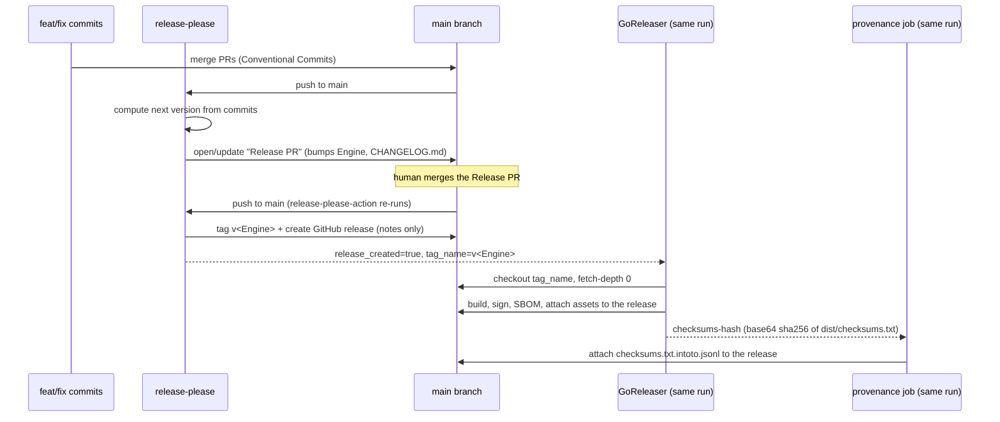

<!-- SPDX-License-Identifier: Apache-2.0 -->
<!-- Copyright (c) 2026 The Koryph Developers -->

# Releasing & versioning

Koryph follows [Semantic Versioning 2.0.0](https://semver.org).

## Semver policy

| Change | Version component |
|---|---|
| Breaking change to the project JSON contract, CLI flags, or engine API | **MAJOR** |
| New backward-compatible feature or engine capability | **MINOR** |
| Bug fix, documentation, internal refactor | **PATCH** |

Pre-1.0 rule: minor bumps may carry breaking changes while the project is
`0.x`. Document every breaking change in the commit body and in the release
notes (release-please lifts this straight from Conventional Commit
`BREAKING CHANGE:` footers — see below).

## Release automation overview

Releases are cut by **release-please**, chained in the same GitHub Actions
run into **GoReleaser**. Nothing about tagging or publishing is manual
anymore; the only human action is *deciding when to merge the Release PR*.



All three jobs live in one workflow file: `.github/workflows/release-please.yml`.

### Why one workflow, not two

Tags created by GitHub Actions' default `GITHUB_TOKEN` do **not** trigger
other `on: push: tags` workflows (a deliberate anti-recursion guard in
GitHub Actions). A separate, tag-triggered GoReleaser workflow — the old
`release.yml` shape — would therefore never fire off release-please's tag.
Instead, GoReleaser runs as a second job in the *same* workflow run, gated on
the first job's `release_created` output, and explicitly checks out
`tag_name` with `fetch-depth: 0`. No PAT is needed for this part.

### Who creates the GitHub release

release-please creates the GitHub release (with its Conventional-Commit
changelog) when it tags. GoReleaser does **not** try to create a second
release for the same tag — `.goreleaser.yaml`'s `release.mode:
keep-existing` tells it to find the release release-please already made and
attach build artifacts to it, keeping release-please's notes. This keeps
asset upload to a single, tag-triggered run, satisfying GoReleaser
`>=2.16`'s **immutable releases** model (no post-publish mutation of a
release's asset set).

## `internal/version.Engine`

The single source of truth for the current engine version is still the
constant `Engine` in `internal/version/version.go`:

```go
const Engine = "0.3.0" // x-release-please-version
```

**Sharp edge:** release-please's `release-type: go` strategy (used here)
**ignores `version-file` entirely** — it has no built-in notion of a Go
version constant to bump. Instead, `release-please-config.json` lists
`internal/version/version.go` under `packages["."]["extra-files"]`, which
invokes release-please's **generic updater**: it scans the file for a line
carrying the `// x-release-please-version` comment and rewrites the quoted
version string on that exact line. Do not remove the annotation or move the
constant off that line — release-please will silently stop bumping it if you
do (there is no linter for this: it just fails quietly).

No other file hard-codes the version. `koryph.project.json`'s
`engine_version` is a compatibility *floor*, not the current version — it is
edited by hand only when the project needs to require a newer minimum.

## Conventional Commits (drives versioning + changelog)

Every commit must follow Conventional Commits:

```
type(scope): subject in imperative mood, lowercase, ≤72 chars
```

Accepted types: `feat`, `fix`, `docs`, `chore`, `refactor`, `test`, `ci`,
`build`, `perf`, `style`. Breaking changes add `!` after the type or scope
(`feat!:`) and a `BREAKING CHANGE:` footer.

release-please parses these to decide the next version (`feat` → minor,
`fix` → patch, `!`/`BREAKING CHANGE:` → major, pre-1.0 exceptions per the
semver policy above) and to group the changelog it writes into the Release
PR and the GitHub release.

Commits must also carry `Signed-off-by` (DCO) and be cryptographically
signed (see `CONTRIBUTING.md` at the repo root). This applies to *your*
commits; release-please's own commits are covered separately below.

## Cutting a release

1. Land `feat`/`fix`/etc. commits on `main` as usual (normal PR flow).
2. release-please opens or updates a standing **Release PR** — title like
   `chore(release): release 0.4.0`, body a full changelog since the last
   tag, diff bumps `internal/version/version.go`'s `Engine` line and
   `CHANGELOG.md`. It keeps this PR current on every push to `main`; there is
   nothing to run by hand.
3. Review the Release PR like any other PR: check the version bump matches
   the semver policy (a `feat!:` in the batch should have produced a major
   bump, etc.) and skim the generated changelog for accuracy.
4. **Merge it** (the human action that actually cuts the release). On merge,
   release-please-action re-runs, detects the merged Release PR, and:
   - tags `v<Engine>` (matching the bumped constant exactly),
   - creates the GitHub release with the changelog as its notes.
5. In the same workflow run, the `goreleaser` job (gated on
   `release_created`) checks out that tag and publishes build artifacts —
   binaries, `checksums.txt`, a cosign `--bundle` signature, and per-archive
   SPDX SBOMs — onto the release release-please just created.
6. Still in the same run, the `provenance` job attaches a SLSA Build L3
   attestation (`checksums.txt.intoto.jsonl`) covering `checksums.txt`.
7. Nothing left to do. Verify the release looks right on the Releases page.

`make release-snapshot` still works locally for a dry run — it forces
`GORELEASER_CURRENT_TAG` unset, so the version-alignment `before:` hook is
skipped and `snapshot.version_template` is used instead
(`make version-check TAG=vX.Y.Z` is still available on demand if you want to
check `Engine` against an arbitrary tag string).

## DCO on release-please's own commits

release-please's Release PR commits and merge/tag actions are made through
the GitHub API using the workflow's `GITHUB_TOKEN` — there is no `git commit
-s` step to run. `release-please-config.json` sets the top-level `signoff`
field:

```json
"signoff": "github-actions[bot] <41898282+github-actions[bot]@users.noreply.github.com>"
```

which makes release-please append a `Signed-off-by:` trailer matching that
identity to the commits it authors, satisfying the same DCO check `ci.yml`
runs on human PRs (the check is not bot-exempted for this identity — only
`dependabot[bot]` is — so without `signoff` configured, the Release PR would
fail the DCO gate). Commits made via the GitHub API are also automatically
GPG-signed by GitHub's own "web-flow" key, which satisfies the repo's
signed-commit ruleset without any signing key of ours being involved.

## Signed & attested release artifacts (sigstore keyless)

GoReleaser signs `checksums.txt` **keylessly** with cosign — the workflow's
GitHub OIDC identity is the certificate subject (issued by Fulcio, recorded
in the Rekor transparency log). No signing key exists anywhere, so there is
nothing to leak or rotate. The `--bundle` flag produces a single
`checksums.txt.sigstore.json` file (certificate + signature combined) rather
than the older separate `.sig`/`.pem` pair.

To verify a release artifact:

```sh
sha256sum -c --ignore-missing checksums.txt   # binary matches the manifest

cosign verify-blob \
  --bundle checksums.txt.sigstore.json \
  --certificate-identity-regexp 'https://github.com/koryph/koryph' \
  --certificate-oidc-issuer https://token.actions.githubusercontent.com \
  checksums.txt
```

A successful verification proves the manifest was produced by this
repository's release workflow — and the checksum match extends that trust to
the binary itself.

### SBOMs

Every release archive gets a companion SPDX SBOM,
`<archive>.sbom.spdx.json`, generated by syft as part of the same GoReleaser
run (`sboms:` in `.goreleaser.yaml`). `make sbom` produces the equivalent
locally (module-wide, not per-archive) for ad hoc scanning outside a release.

### SLSA Build L3 provenance

A third job in `.github/workflows/release-please.yml`, `provenance`, calls
[`slsa-framework/slsa-github-generator`](https://github.com/slsa-framework/slsa-github-generator)'s
**generic** generator (`generator_generic_slsa3.yml`, pinned to `@v2.1.0` —
reusable workflows from this repo must be referenced by tag, not a commit
SHA, per its own documented requirement) as a reusable workflow. It runs
after `goreleaser`, consuming a base64-encoded sha256 hash of
`dist/checksums.txt` that the `goreleaser` job exports as a job output
(`checksums-hash`). Because this whole pipeline is triggered by a push to
`main` rather than a tag push, the generator is pointed at the release via
`upload-tag-name: ${{ needs.release-please.outputs.tag_name }}` instead of
relying on `github.ref` — the documented mechanism for uploading to a
release from a non-tag-triggered run. The generic builder does not build
anything itself; it only attests to the digest it is given, so it composes
cleanly with GoReleaser (the Go-native SLSA builder, by contrast, replaces
the build step and cannot be used here).

The provenance attestation is uploaded to the release as
`checksums.txt.intoto.jsonl`. Since `checksums.txt` already carries the
sha256 of every binary and archive in the release, attesting to that one
file's provenance extends to the rest of the release's assets by the same
"checksum match" chain the cosign verification above relies on.

To verify a release artifact's provenance with
[`slsa-verifier`](https://github.com/slsa-framework/slsa-verifier)
(`go install github.com/slsa-framework/slsa-verifier/v2/cli/slsa-verifier@v2.7.1`,
or download a prebuilt binary from its releases page):

```sh
# Download checksums.txt and checksums.txt.intoto.jsonl from the release first.
slsa-verifier verify-artifact checksums.txt \
  --provenance-path checksums.txt.intoto.jsonl \
  --source-uri github.com/koryph/koryph \
  --source-tag v0.4.0   # the release tag being verified
```

A `PASSED: Verified SLSA provenance` result proves `checksums.txt` (and, by
the `sha256sum -c` chain above, every binary it lists) was built by this
repository's GitHub Actions workflow at the claimed tag — Build Level 3,
non-forgeable provenance, not just a keyless signature.

## First-release checklist (validate before relying on this pipeline)

The Actions run itself cannot be exercised locally — `goreleaser check` and
`make gate` validate the config and code, but not GitHub's release-please PR
mechanics, permissions, or ruleset interactions. Before treating this
pipeline as load-bearing (and certainly before deleting any remaining
references to the old manual flow), validate on a **throwaway PR/commit** in
this repo:

- [ ] **release-please opens a Release PR at all.** Push a `feat:`/`fix:`
      commit to `main` (or a scratch branch pointed at a copy of the
      workflow) and confirm the `release-please` job runs and opens/updates
      a PR with the expected version bump and changelog.
- [ ] **`extra-files` actually bumps `Engine`.** Confirm the Release PR's
      diff includes `internal/version/version.go` with the constant updated
      to the new version, on the `x-release-please-version`-annotated line,
      and nowhere else in the file.
- [ ] **DCO passes on the Release PR.** Confirm `ci.yml`'s DCO check (which
      is not bot-exempted for this identity) sees the `Signed-off-by:`
      trailer from the `signoff` config and passes.
- [ ] **Commit signatures pass the repo's signed-commit ruleset.** Confirm
      GitHub shows the Release PR's commits as "Verified" (web-flow key) and
      that the ruleset accepts them — this is what the roadmap design calls
      out as the load-bearing assumption for skipping SSH/gitsign signing on
      bot commits.
- [ ] **The Release PR actually satisfies required status checks to merge.**
      This is a known GitHub Actions limitation, separate from the
      tag-trigger problem this design already solves: commits pushed to a PR
      branch by the default `GITHUB_TOKEN` do **not** trigger
      `on: pull_request` workflows on that PR. If branch protection requires
      `ci.yml`'s checks before merge, the Release PR may show pending/missing
      checks with no way to satisfy them automatically. Confirm what actually
      happens on a real PR; if checks never run, the fix is either a repo
      ruleset carve-out for release-please's Release PR, or switching
      release-please-action's `token` input to a scoped PAT (which, unlike
      `GITHUB_TOKEN`, does trigger `pull_request` workflows) — this is a
      repo-configuration decision, not something this change makes for you.
- [ ] **`release_created`/`tag_name` outputs actually gate/feed the
      `goreleaser` job.** Merge the throwaway Release PR and confirm the
      `goreleaser` job runs (not skipped), checks out the correct tag, and
      that `make version-check` passes against it.
- [ ] **GoReleaser attaches to release-please's release, not a duplicate.**
      Confirm exactly one GitHub release exists for the tag afterward, with
      release-please's changelog as the body and GoReleaser's binaries,
      `checksums.txt`, `checksums.txt.sigstore.json`, and per-archive SBOMs
      all attached.
- [ ] **cosign verification works end-to-end** using the commands above
      against a real published artifact (Rekor entry included).
- [ ] **The `provenance` job runs and attaches `checksums.txt.intoto.jsonl`
      to the same release.** Confirm it is not skipped, that
      `needs.goreleaser.outputs.checksums-hash` was non-empty going in (i.e.
      the `dist/checksums.txt` hash step actually ran before it), and that
      `upload-tag-name` correctly targeted release-please's tag from this
      push-triggered (not tag-triggered) run.
- [ ] **`slsa-verifier verify-artifact` passes end-to-end** against
      `checksums.txt` and its downloaded `checksums.txt.intoto.jsonl` from a
      real published release, using the command above.
- [ ] Only after all of the above hold: consider the manual `release.yml`
      flow fully retired (it already is, in this change — this checklist is
      what makes that removal safe rather than aspirational).
